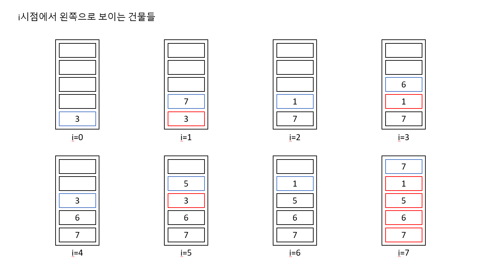

https://www.acmicpc.net/problem/22866

# Pass 1 - JavaScript
~~~javascript
let input = require("fs").readFileSync("input.txt").toString().split("\n");
// let input = require("fs").readFileSync("/dev/stdin").toString().trim().split('\n');
let [n] = input[0].split(" ").map(Number);
let arr = input[1].split(" ").map(Number);
//<------------input
let answer = "";

class Stack {
  constructor() {
    this.data = [];
  }
  push(item) {
    this.data.push(item);
  }
  pop() {
    this.data.pop();
  }
  size() {
    return this.data.length;
  }
  peek() {
    return this.data[this.data.length - 1];
  }
}

class Building {
  constructor(index, height) {
    this.index = index;
    this.height = height;
  }
}

class NearBuilding {
  constructor(index, gap) {
    this.index = index;
    this.gap = gap;
  }
}

let count = new Array(n).fill(0);
let near = new Array(n).fill().map(() => new NearBuilding(-1, Infinity));
//------------------->
let stack = new Stack();
for (let i = 0; i < n; i++) {
  handleStack(i);
}

//<-------------------
stack = new Stack();
for (let i = n - 1; i >= 0; i--) {
  handleStack(i);
}

//스택 관리
function handleStack(i) {
  let building = new Building(i, arr[i]);
  //새로운 건물을 기준으로, 나보다 작거나 같은 건물들이 보일때까지 모두 없앤다
  while (stack.size() > 0 && stack.peek().height <= building.height) {
    stack.pop();
  }

  //남은 건물이 나보다 큰 건물이다
  count[i] += stack.size();

  //제일 처음 보이는 건물을 기준으로 가장 가까운 건물인지 확인
  if (stack.size() > 0) {
    let gap = Math.abs(stack.peek().index - i);
    if (gap < near[i].gap) {
      near[i].index = stack.peek().index;
      near[i].gap = gap;
    } //
    else if (gap === near[i].gap && stack.peek().index < near[i].index) {
      near[i].index = stack.peek().index;
    }
  }

  //새로운 건물 스택에 추가
  stack.push(building);
}

//각 건물에 대해서 개수와 가장 가까운 건물 추가
for (let i = 0; i < n; i++) {
  let v1 = count[i];
  let v2 = near[i].index + 1;
  answer += v1 + " " + (v1 > 0 ? v2 : "") + "\n";
}

console.log(answer);

~~~

