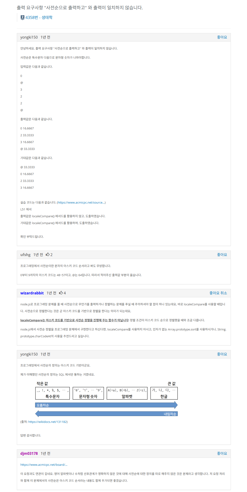

https://www.acmicpc.net/problem/4358

# Pass 1 - JavaScript
~~~javascript
let input = require("fs").readFileSync("input.txt").toString().split("\n");
// let input = require("fs").readFileSync("/dev/stdin").toString().trim().split('\n');
// let [n] = input[0].split(" ").map(Number);
//<------------input
let answer = "";

let map = new Map();
for (let s of input) {
  map.set(s, map.get(s) + 1 || 1);
}
let array = Array.from(map).sort((a, b) => (a[0] < b[0] ? -1 : 1));

array.forEach(([name, count]) => {
  const res = ((count / input.length) * 100).toFixed(4);
  answer += `${name} ${res}\n`;
});

console.log(answer);

~~~

주의 https://www.acmicpc.net/board/view/137467  
  
