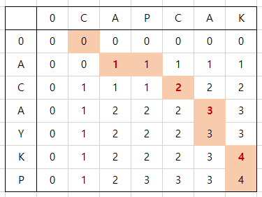

https://www.acmicpc.net/problem/9252

# Pass 1 - JavaScript
~~~javascript
let input = require("fs")
  .readFileSync("input.txt")
  .toString()
  .trim()
  .split("\n");
// let input = require("fs").readFileSync("/dev/stdin").toString().trim().split('\n');
let str1 = " " + input[0];
let str2 = " " + input[1];
//<------------input

let answer = "";
let n = str1.length;
let m = str2.length;

//표 만들기
let dp = Array.from(Array(n), () => Array(m).fill(0));
for (let i = 1; i < n; i++) {
  for (let j = 1; j < m; j++) {
    if (str1[i] === str2[j]) {
      dp[i][j] = dp[i - 1][j - 1] + 1;
    } else {
      dp[i][j] = Math.max(dp[i - 1][j], dp[i][j - 1]);
    }
  }
}
let answer1 = dp[n - 1][m - 1];
let answer2 = "";

//글자 찾기
let i = n - 1;
let j = m - 1;
while (dp[i][j] > 0) {
  if (str1[i] === str2[j]) {
    answer2 = str1[i] + answer2;
    i--;
    j--;
  } else {
    if (dp[i - 1][j] > dp[i][j - 1]) {
      i--;
    } else {
      j--;
    }
  }
}
answer = answer1 + "\n" + answer2;

console.log(answer);

~~~

