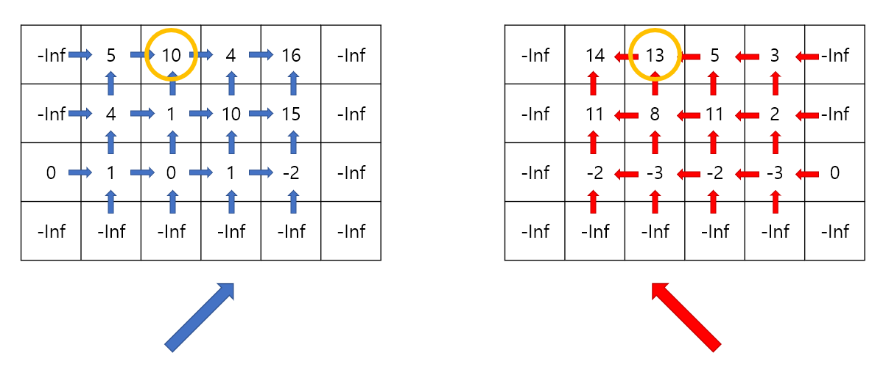

https://www.acmicpc.net/problem/21923

# Pass 1 - JavaScript

```javascript
let input = require("fs").readFileSync("input.txt").toString().split("\n");
// let input = require("fs").readFileSync("/dev/stdin").toString().trim().split('\n');
let [n, m] = input[0].split(" ").map(Number);
let arr = input.slice(1, 1 + n).map((v) => v.split(" ").map(Number));
//<------------input
let answer = -Infinity;

let map = new Array(n + 1).fill().map(() => new Array(m + 2).fill(0));
for (let i = 0; i < n; i++) {
  for (let j = 0; j < m; j++) {
    map[i][j + 1] = arr[i][j];
  }
}

//배열 초기화
function init() {
  let dp = new Array(n + 1).fill().map(() => new Array(m + 2).fill(0));
  for (let i = 0; i < n + 1; i++) {
    dp[i][0] = -Infinity;
    dp[i][m + 1] = -Infinity;
  }
  for (let j = 0; j < m + 2; j++) {
    dp[n][j] = -Infinity;
  }
  return dp;
}

//상승
let up = init();
up[n - 1][0] = 0;
for (let i = n - 1; i >= 0; i--) {
  for (let j = 1; j < m + 1; j++) {
    up[i][j] = Math.max(up[i + 1][j], up[i][j - 1]) + map[i][j];
  }
}

//하강
let down = init();
down[n - 1][m + 1] = 0;
for (let i = n - 1; i >= 0; i--) {
  for (let j = m; j >= 1; j--) {
    down[i][j] = Math.max(down[i + 1][j], down[i][j + 1]) + map[i][j];
  }
}

for (let i = 0; i < n; i++) {
  for (let j = 1; j < m + 2; j++) {
    answer = Math.max(answer, up[i][j] + down[i][j]);
  }
}

console.log(answer);
```


