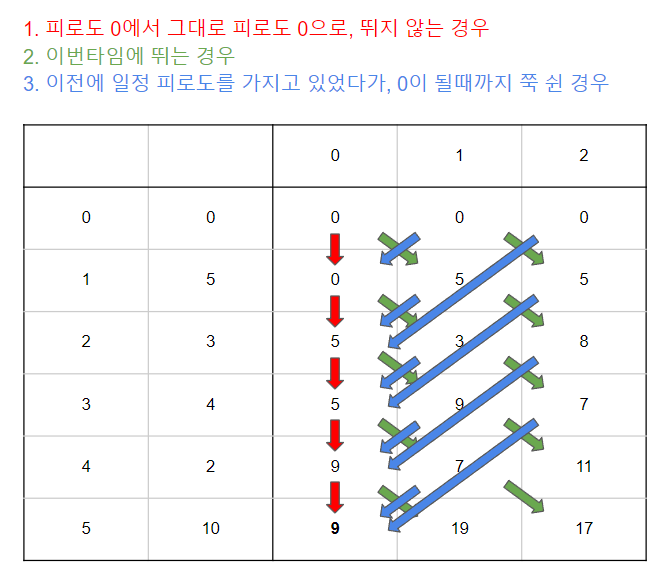

https://www.acmicpc.net/problem/1757

# Pass 1 - JavaScript
~~~javascript
let input = require("fs").readFileSync("input.txt").toString().split("\n");
// let input = require("fs").readFileSync("/dev/stdin").toString().trim().split('\n');
let [n, m] = input[0].split(" ").map(Number);
let arr = input.slice(1, 1 + n).map(Number);
//<------------input
let answer = 0;

arr.unshift(0);

let dp = new Array(n + 1).fill().map(() => new Array(m + 1).fill(0));
for (let i = 1; i < n + 1; i++) {
  //1.피로도 0에서 그대로 피로도 0으로, 뛰지 않는 경우
  dp[i][0] = dp[i - 1][0];

  //2.이번타임에 뛰는 경우
  for (let j = 1; j < m + 1; j++) {
    dp[i][j] = dp[i - 1][j - 1] + arr[i];
  }

  //3. 이전에 일정 피로도를 가지고 있었다가, 0이 될때까지 쭉 쉰 경우
  for (let j = 1; j < m + 1; j++) {
    if (i >= j) {
      dp[i][0] = Math.max(dp[i][0], dp[i - j][j]);
    }
  }
}

answer = dp[n][0];

console.log(answer);

~~~

