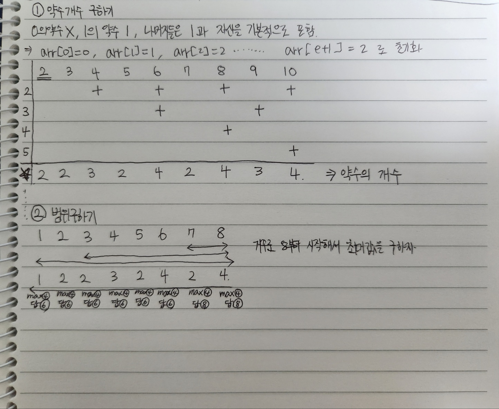

https://school.programmers.co.kr/learn/courses/30/lessons/138475

# Solution 1 - JavasSript
~~~javascript
function solution(e, starts) {
    let answer = [];
    //억억단에서 등장하는 횟수 -> 약수의 개수
    
    //약수 개수 구하기
    let arr = Array.from(Array(e+1),()=>2); 
    arr[0]=0;
    arr[1]=1;
    for(let n=2;n<=e;n++){
        for(let m=n*2;m<=e;m+=n){
            arr[m]++;
        }
    }
    
    //범위별 최대값 찾기
    let max = 0;
    let arr2 = Array.from(Array(e+1),()=>null);
    for(let n=e;n>=1;n--){
        if(arr[n]>=max){
            arr2[n]=n;
            max = arr[n];
        }
        else{
            arr2[n]=arr2[n+1];
        }
    }
    
    
    //결과 도출
    answer = starts.map((v) => arr2[v]);
    
    
    return answer;
}
~~~
  
  
  
  
  

  
