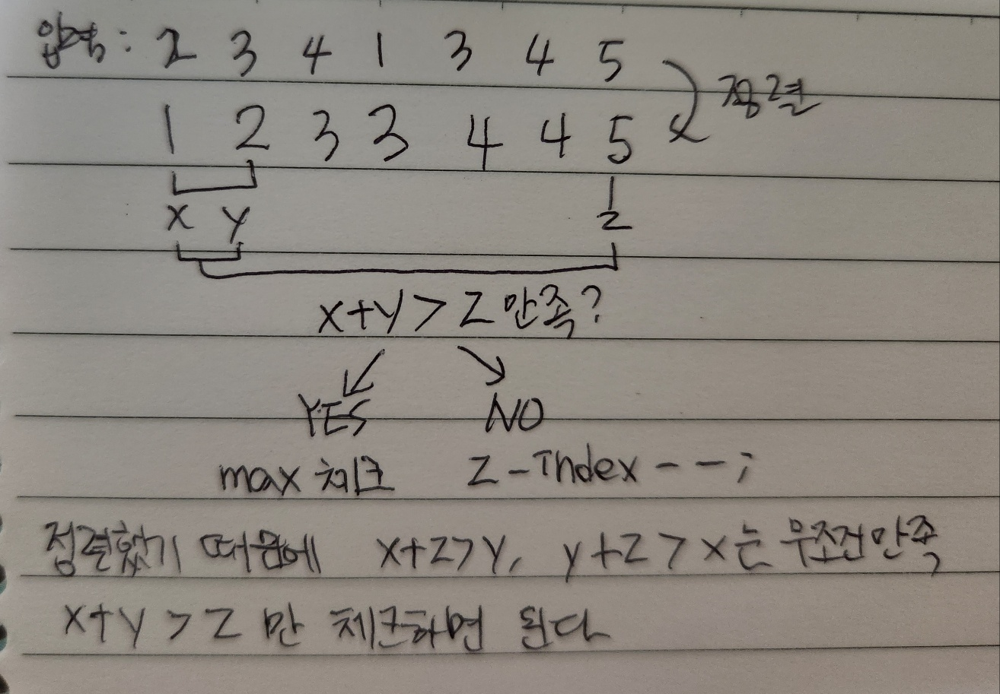

https://www.acmicpc.net/problem/1548

# Pass 1 - JavaScript
~~~javascript
let input = require("fs").readFileSync("input.txt").toString().split("\n");
// let input = require("fs").readFileSync("/dev/stdin").toString().split('\n');
let [n] = input[0].split(" ").map(Number);
let arr = input[1].split(" ").map(Number);
//<------------input
let answer = Math.min(n, 2);

arr.sort((a, b) => a - b);

for (let i = 0; i < n - 2; i++) {
  for (let k = n - 1; k > i + 1; k--) {
    let [x, y, z] = [arr[i], arr[i + 1], arr[k]];
    if (x + y > z) {
      answer = Math.max(answer, k - i + 1);
      break;
    }
  }
}

console.log(answer);

~~~

