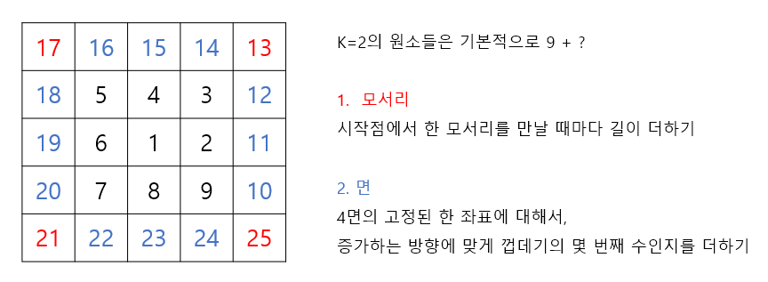

https://www.acmicpc.net/problem/1022

# Pass 1 - JavaScript
~~~javascript
let input = require("fs").readFileSync("input.txt").toString().split("\n");
// let input = require("fs").readFileSync("/dev/stdin").toString().trim().split('\n');
let [r1, c1, r2, c2] = input[0].split(" ").map(Number);
//<------------input
let answer;

let all = [];
let max = 0;

for (let i = r1; i <= r2; i++) {
  let line = [];
  for (let j = c1; j <= c2; j++) {
    //몇번째 껍데기 인가
    let k = Math.max(Math.abs(i), Math.abs(j));

    let x = (k * 2 - 1) ** 2;

    //모서리 4개 검사
    if (i === -k && j === k) {
      x += k * 2 * 1;
    } //
    else if (i === -k && j === -k) {
      x += k * 2 * 2;
    } //
    else if (i === k && j === -k) {
      x += k * 2 * 3;
    } //
    else if (i === k && j === k) {
      x += k * 2 * 4;
    }

    //모서리 제외 (k*2+1)**2-(k*2-1)**2개 검사
    else if (j === k) {
      x += k * 2 * 0 + (-i + k);
    } //
    else if (i === -k) {
      x += k * 2 * 1 + (-j + k);
    } //
    else if (j === -k) {
      x += k * 2 * 2 + (i + k);
    } //
    else if (i === k) {
      x += k * 2 * 3 + (j + k);
    }

    x = x.toString();

    line.push(x);
    max = Math.max(max, x.length);
  }
  all.push(line);
}
answer = all.map((line) => line.map((x) => x.padStart(max, " ")).join(" ")).join("\n");

console.log(answer);

~~~

