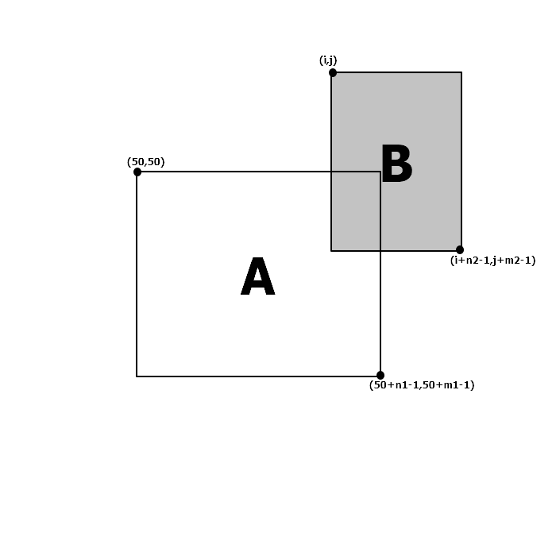

https://www.acmicpc.net/problem/21277

# Pass 1 - JavaScript
~~~javascript
let input = require("fs").readFileSync("input.txt").toString().split("\n");
// let input = require("fs").readFileSync("/dev/stdin").toString().trim().split('\n');
let [n1, m1] = input[0].split(" ").map(Number);
let map1 = input.slice(1, 1 + n1);
let [n2, m2] = input[1 + n1].split(" ").map(Number);
let map2 = input.slice(1 + n1 + 1, 1 + n1 + 1 + n2);
//<------------input
let answer = Infinity;

let A = new Array(150).fill().map(() => new Array(150).fill("0"));
for (let i = 0; i < n1; i++) {
  for (let j = 0; j < m1; j++) {
    A[i + 50][j + 50] = map1[i][j];
  }
}

for (let d = 0; d < 4; d++) {
  // map2를 회전
  let B = new Array(m2).fill().map(() => new Array(n2));
  for (let i = 0; i < m2; i++) {
    for (let j = 0; j < n2; j++) {
      B[i][j] = map2[n2 - 1 - j][i];
    }
  }
  [n2, m2] = [m2, n2];
  map2 = B;

  //완전탐색
  for (let i = 50 - n2; i < 50 + n1 + 1; i++) {
    for (let j = 50 - m2; j < 50 + m1 + 1; j++) {
      let flag = true;
      loop: for (let ii = 0; ii < n2; ii++) {
        for (let jj = 0; jj < m2; jj++) {
          if (A[i + ii][j + jj] === "1" && B[ii][jj] === "1") {
            flag = false;
            break loop;
          }
        }
      }
      if (flag) {
        let minX = Math.min(i, 50);
        let maxX = Math.max(i + n2 - 1, 50 + n1 - 1);
        let minY = Math.min(j, 50);
        let maxY = Math.max(j + m2 - 1, 50 + m1 - 1);

        let height = maxX - minX + 1;
        let width = maxY - minY + 1;
        answer = Math.min(answer, height * width);
      }
    }
  }
}

console.log(answer);

~~~

사각형의 최대 범위가 50이므로, A를 (50,50)을 기준으로 고정  
B는 A와 접하도록 반복적으로 위치시키면서 확인한다  
B내의 점들에 대해서 A와 퍼즐이 겹치지 않는지 검사  
