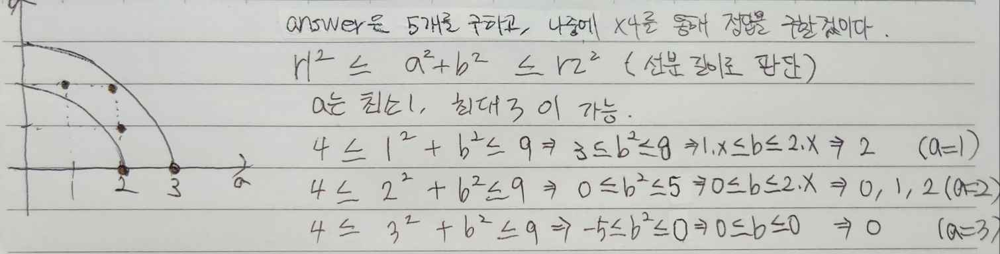

https://school.programmers.co.kr/learn/courses/30/lessons/181187

# Solution 1 - JavaScript
~~~javascript
function solution(r1, r2) {
    let answer = 0;
    
    for(let a=1;a<=r2;a++){
        let b_min = (r1*r1 - a*a <=0) ? 0 : (r1*r1 - a*a);
        let b_max = r2*r2 - a*a;
        answer += Math.floor(Math.sqrt(b_max))-Math.ceil(Math.sqrt(b_min))+1;    
    }
    answer *= 4;
    
    return answer;
}
~~~
  
  
  

