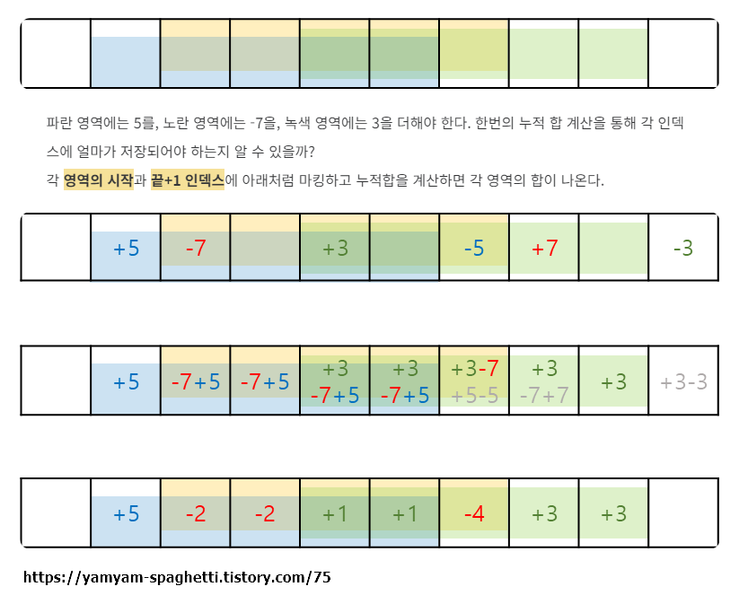

https://school.programmers.co.kr/learn/courses/30/lessons/92344

# Pass 1 - JavaScript
~~~javascript
function solution(board, skill) {
    let answer = 0;
    
    let [n,m] = [board.length,board[0].length];
    let board2 = Array.from(Array(n+1),()=>Array(m+1).fill(0));
    
    //시작, 도착 지점 메모
    for(let [type, r1, c1, r2, c2, degree] of skill){
        let c = type===1 ? -1 : 1;
        board2[r1][c1] += c * degree;
        board2[r1][c2+1] -= c * degree;
        board2[r2+1][c1] -= c * degree;
        board2[r2+1][c2+1] += c * degree;
    }
    //가로&세로 방향으로 누적시키기
    for(let i=0;i<n;i++){
        for(let j=1;j<m;j++){
            board2[i][j] += board2[i][j-1];
        }
    }
    for(let j=0;j<m;j++){
        for(let i=1;i<n;i++){
            board2[i][j] += board2[i-1][j];
        }
    }
    //원래 배열과 더하기
    for(let i=0;i<n;i++){
        for(let j=0;j<m;j++){
            if(board[i][j]+board2[i][j]>0){
                answer++;
            }
        }
    }
    
    return answer;
}
~~~

  
출발지는 +로 두고... 도착지까지는 +가 되게 하면서 누적되는데 도착지 다음 칸에는 -로 두어서 0으로 상쇄시킴  
따라서 원하는 구간에만 값을 더할 수 있음  
이차원 배열도 마찬가지로 가로는 왼쪽에+ 오른쪽에-, 세로는 위쪽에+ 아래쪽에-인데. 오른쪽아래는 2번 빠지므로 +해준다  
따라서 아래와 같은 형태  
(+) ... (-)  
...&nbsp;&nbsp;&nbsp;&nbsp;&nbsp;&nbsp;&nbsp;&nbsp;...  
(-) ... (+)  
