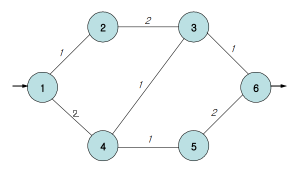

https://www.acmicpc.net/problem/2307

# Pass 1 - JavaScript
~~~javascript
let input = require("fs")
  .readFileSync("input.txt")
  .toString()
  .trim()
  .split("\n");
// let input = require("fs").readFileSync("/dev/stdin").toString().trim().split('\n');
let [n, m] = input[0].split(" ").map(Number);
let arr = input.slice(1, 1 + m).map((v) => v.split(" ").map(Number));
//<------------input

let answer = 0;

let edges = Array.from(Array(n + 1), () => []); //양방향 그래프
for (let i = 0; i < arr.length; i++) {
  edges[arr[i][0]].push([arr[i][1], arr[i][2]]);
  edges[arr[i][1]].push([arr[i][0], arr[i][2]]);
}

let path = Array.from(Array(n + 1), () => []); //최단 경로
path[1] = ["1"];
let visit = Array.from(Array(n + 1), () => Infinity); //최단 거리 값
visit[1] = 0;

let queue = [1]; //시작점
while (queue.length) {
  let from = queue.shift();

  for (let [to, weight] of edges[from]) {
    if (visit[from] + weight <= visit[to]) {
      if (visit[from] + weight < visit[to]) {
        //최소값을 갱신하는 경우에만
        visit[to] = visit[from] + weight; //최소값 갱신
        path[to] = []; //경로 초기화
      }
      queue.push(to); //최단경로는 여러개이기 때문
      for (let i = 0; i < path[from].length; i++) {
        if (path[to].indexOf(path[from][i] + " " + to) < 0) {
          //가지고 있지 않은 경로일 경우 추가
          path[to].push(path[from][i] + " " + to);
        }
      }
    }
  }
}

let min = visit[n]; //최소거리
let max = 0; //최대거리

//그냥 경로 자체가 없다
if (visit[n] === Infinity) {
  answer = -1;
}

//경로가 존재한다
//최단 경로상의 모든 도로들을 조사해서
//막았을때 통과가 되면, 최대최소 비교
//하나라도 통과 안되는거 발견? -1 끝
else {
  loop: for (let string of path[n]) {
    //["1 2 3 6", "1 4 5 6"] -> 최단 경로 2가지
    let node = string.split(" ").map(Number); //[1,2,3,6] -> 1-2, 2-3, 3-6
    for (let i = 0; i < node.length - 1; i++) {
      let check = [node[i], node[i + 1]]; //[1,2]를 막는다...

      //일반 다익스트라와 동일
      visit = Array.from(Array(n + 1), () => Infinity);
      visit[1] = 0;

      let queue = [1];
      while (queue.length) {
        let from = queue.shift();

        for (let [to, weight] of edges[from]) {
          if (from === check[0] && to === check[1]) {
            //막은 도로
            continue;
          }
          if (from === check[1] && to === check[0]) {
            //막은 도로
            continue;
          }
          if (visit[from] + weight < visit[to]) {
            visit[to] = visit[from] + weight;
            queue.push(to);
          }
        }
      }
      if (visit[n] === Infinity) {
        answer = -1;
        break loop;
      }
      max = Math.max(max, visit[n]);
    }
  }
}
if (answer !== -1) {
  answer = max - min;
}

console.log(answer);

~~~
  

  

모든 경로를 찾아서 막으면 시간초과가 난다  
최단경로들을 찾아 거기에 속한 도로만 검사하도록 한다  

최단경로 찾기 설명  
최단경로는 여러개 존재할 수 있기 때문에 기존 거리값보다 작거나 같은 조건을 확인해야 한다  
최소값을 갱신하는 경우에만 최소값 갱신 및 경로를 초기화 해준다  
최소값과 동일한 경우는 기존 경로에 새 경로를 추가해준다  
3번의 path가 ["1 2 3"]이고, 6번의 path가 ["1 2 3 6"]인 상태로  
3번의 path에 "1 4 3"이 추가가 되면, 6번의 path를 갱신해야 하기 때문에 3번을 queue에 추가한다  
이 경우 갱신된 3번의 path ["1 2 3", "1 4 3"]에 6을 붙여서 push 하면  
6번의 path가 ["1 2 3 6", "1 2 3 6", "1 4 3 6"]의 중복값을 가지기 때문에  
indexOf를 사용하여 중복된 path를 가지지 않도록 한다  
