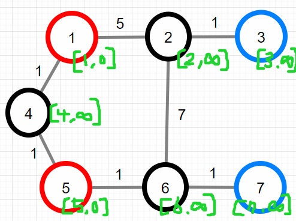
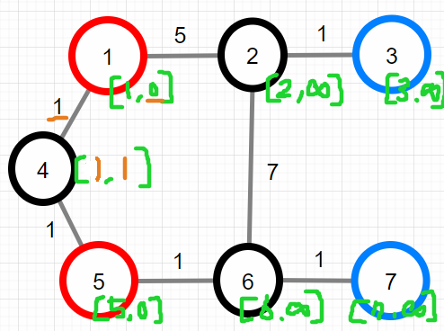
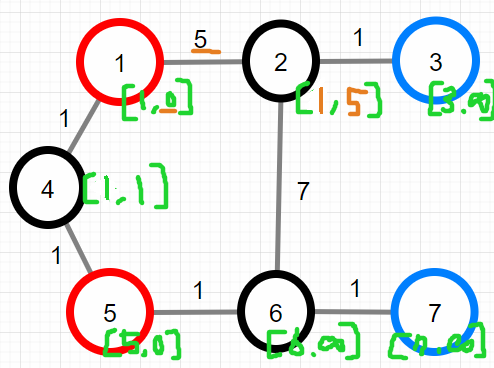
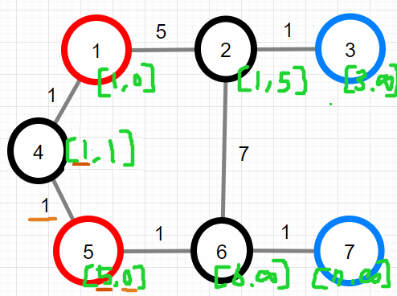
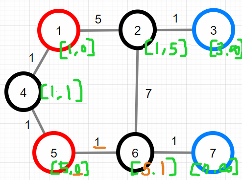
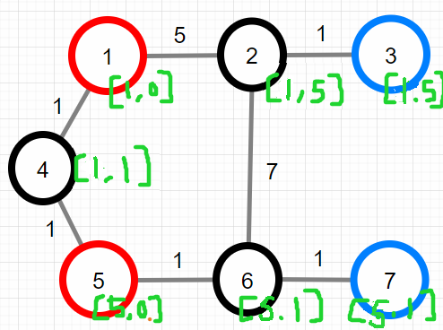

https://school.programmers.co.kr/learn/courses/30/lessons/118669

# Solution 1 - JavasSript
~~~javascript
function solution(n, paths, gates, summits) { //정점개수, 경로, 출입구, 봉우리
    let answer = [0,10000001];
    let edge = Array.from(Array(n+1),()=>[]);
    let isGate = Array.from(Array(n+1),()=>false);
    
    for(let [s,e,w] of paths){ //인접리스트 생성, n이 최대 5만임!
        edge[s].push([e,w]);
        edge[e].push([s,w]);
    }
    for(let gate of gates){ //출발지
        isGate[gate] = true;
    }
    let queue = [];
    let visited = Array.from(Array(n+1),()=>[0, 10000001]); //봉우리, 인텐시티
    for(let summit of summits){ //모든 봉우리로 도착
        queue.push(summit);
        visited[summit] = [summit, 0];
    }
    
    while(queue.length>0){
        let s = queue.shift();
        for(let [e,w] of edge[s]){ //현재 노드와 이어져 있는 도착노드, 가중치
            let max = Math.max(visited[s][1], w); //현재 가중치와, 미래 가중치 중 큰 값을 구한다
            if(max < visited[e][1]){ //가중치가 더 작은 길을 발견했을 경우
                visited[e] = [visited[s][0], max]; //봉우리와 가중치 값을 갱신
                queue.push(e);
            }
            if(max === visited[e][1] && visited[s][0] < visited[e][0]){ //혹은 봉우리가 더 작은 길을 발견했을 경우
                visited[e] = [visited[s][0], max]; //봉우리 값을 갱신 
                queue.push(e);
            }
        }
    }
    for(let i=1;i<=n;i++){
        if(isGate[i]){ //여러 출발지들에 대해 비교해 볼건데 
            //[5,1]와 [1,5]의 경우, 무조건 작은 인텐시티 값을 따른다
            if(visited[i][1] < answer[1]){ 
                answer = visited[i];
            }
            //[5,1]와 [7,1]의 경우, 인텐시티 값이 같으므로 작은 봉우리를 따른다
            if(visited[i][1] === answer[1] && visited[i][0] < answer[0]){
                answer = visited[i];
            }
        }
    }   

    return answer;
}
~~~

봉우리가 도착지가 되든 출입구가 도착지가 되던 답은 같다.  
나는 봉우리(빨강,도착지)에서 출입구(파랑,출발지)로 탐색하는 방식을 선택했다 -> 1과 5로 오는데에 대한 3과 7의 값 구하기  
봉우리에서 출발했으나 중간에 봉우리를 가는 경우, 도착지에 도착했으나 또 다른 경로를 가는 경우 모두  
max와 visited를 비교하는 과정에서 queue에 push 될 일이 없으므로 굳이 예외를 추가해주지 않아도 된다.   
지금은 queue에 모든 봉우리들을 넣고 bfs탐색을 시작했지만,  
이전에 짠 코드는 봉우리별로 다익스트라를 돌렸기 때문에 시간초과가 발생하였다. (최대 50,000번 queue돌리기 발생)  
또한 가중치값이 같을 경우 작은 봉우리가 정답임에 유의해야 한다.  
풀이 생각해보기...  
일반 다익스트라는 모든 출발지에서 시작해 도착지 K로 가는 최소거리를 판단한다.  
이 문제도 모든 출입구에서 시작해서 모든 봉우리들로 가는 최소거리를 알아야 한다.   
  
  
  
  
  
  
  
  
  
  
  
  
  
  
  
