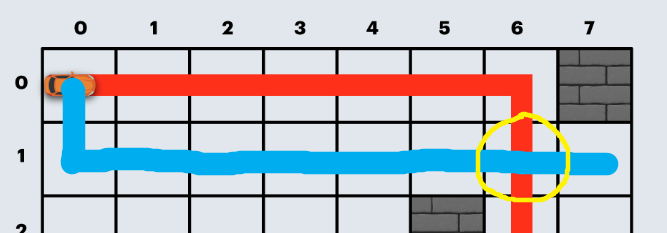

https://school.programmers.co.kr/learn/courses/30/lessons/67259

# Pass 1 - JavaScript
~~~javascript
function solution(board) {
    let answer = 0;
    let n = board.length;
    
    //상하좌우
    let dx = [-1,1,0,0];
    let dy = [0,0,-1,1];
    
    let visit = new Array(n).fill().map(()=>new Array(n).fill(Infinity).map(()=>new Array(4).fill(Infinity)));
    visit[0][0][1] = 0;
    visit[0][0][3] = 0;
    let queue = [[0,0,1], [0,0,3]]; //하, 우 방향에서 출발 가능
    
    while(queue.length){
        let [x,y,z] = queue.shift();
        
        for(let d=0;d<4;d++){
            let nx = x+dx[d];
            let ny = y+dy[d];
            
            if(nx< 0 || nx>=n || ny<0 || ny>=n){
                continue;
            }
            if(board[nx][ny]===1){
                continue;
            }
            
            //이전과 같은 방향 -> 직선 도로
            if(z===d){
                if(visit[x][y][z]+100 < visit[nx][ny][d]){
                    visit[nx][ny][d] = visit[x][y][z]+100;
                    queue.push([nx,ny,d]);
                }
            }
            //이전과 다른 방향 -> 직선 도로 + 코너
            else{
                if(visit[x][y][z]+600 < visit[nx][ny][d]){
                    visit[nx][ny][d] = visit[x][y][z]+600;
                    queue.push([nx,ny,d]);
                }
            }
        }
    }
    
    answer = Math.min(...visit[n-1][n-1]);
    
    return answer;
}
~~~

  
visit에 4방향에 대한 정보를 담아야 하는 이유?  
그림과 같이 교차 지점이 발생 했을때 다른 값을 가지고 있다고 하더라도 미래에 더 유리한 방향이 달라질 수 있다  
