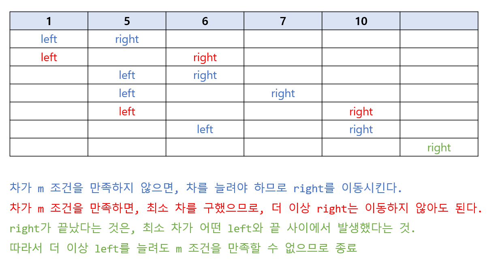

https://www.acmicpc.net/problem/2230

# Pass 1 - JavaScript
~~~javascript
let input = require("fs").readFileSync("input.txt").toString().split("\n");
// let input = require("fs").readFileSync("/dev/stdin").toString().trim().split('\n');
let [n, m] = input[0].split(" ").map(Number);
let arr = input.slice(1, 1 + n).map(Number);
//<------------input
let answer = Infinity;

arr.sort((a, b) => a - b);

for (let i = 0; i < n - 1; i++) {
  for (let j = i + 1; j < n; j++) {
    let diff = arr[j] - arr[i];
    if (diff >= m) {
      answer = Math.min(answer, diff);
      break;
    }
  }
}

console.log(answer);

~~~
3296ms 소요. 돌리지 않아도 될 부분까지 돌려서 오래걸림.  

# Pass 2 - JavaScript
~~~javascript
let input = require("fs").readFileSync("input.txt").toString().split("\n");
// let input = require("fs").readFileSync("/dev/stdin").toString().trim().split('\n');
let [n, m] = input[0].split(" ").map(Number);
let arr = input.slice(1, 1 + n).map(Number);
//<------------input
let answer = Infinity;

arr.sort((a, b) => a - b);

let left = 0;
let right = 1;

while (right < n && left <= right) {
  let diff = arr[right] - arr[left];
  if (diff >= m) {
    answer = Math.min(answer, diff);
    left++;
  } else {
    right++;
  }
}

console.log(answer);

~~~
260ms 소요

